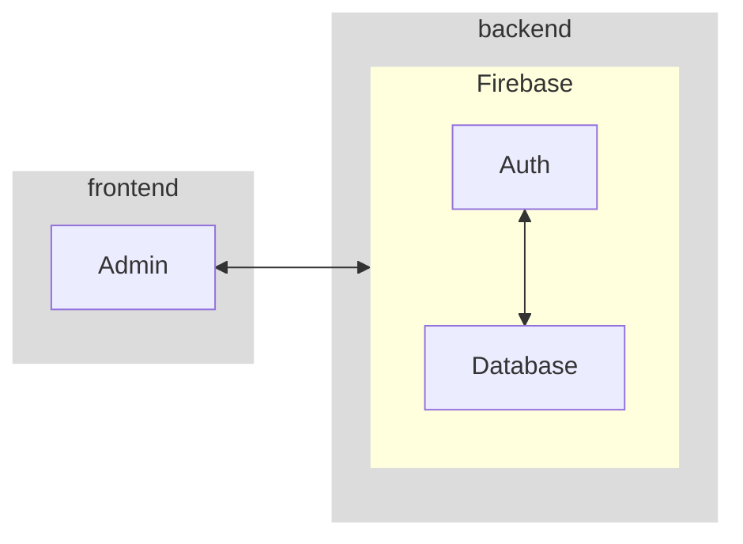

# 💻 Workbook

[Design no Figma](https://www.figma.com/file/nuodG3B6kIlHHJjqlsz6IH/My-Wallet?node-id=2%3A64)

## 🤔 About the Project

Gerenciamento de contas à pagar e à receber.

## 🧪 Tech Stack

### Front-End

- React.js
- Vite.js
- React-Router
- Tailwind.css

### Back-End

- Firebase Realtime
- Firebase Cloud Functions
- Git Actions (CI)
- Prettier
